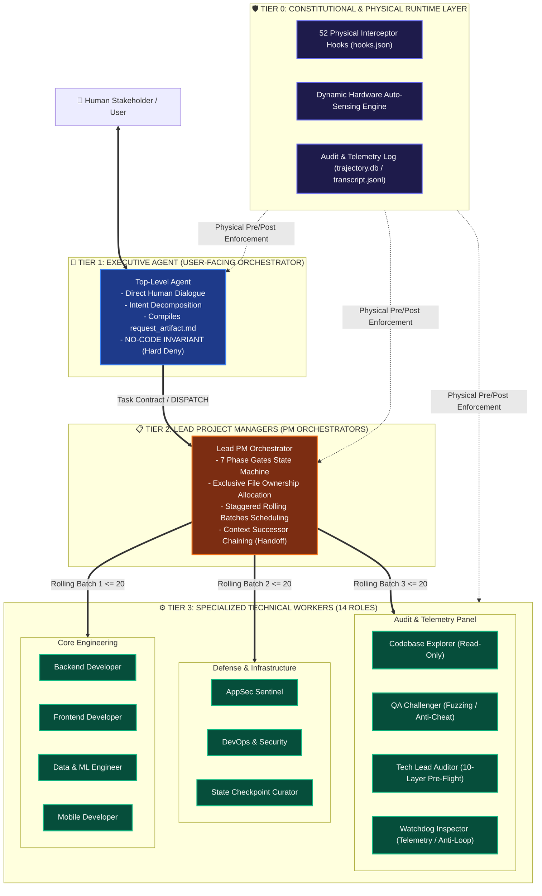
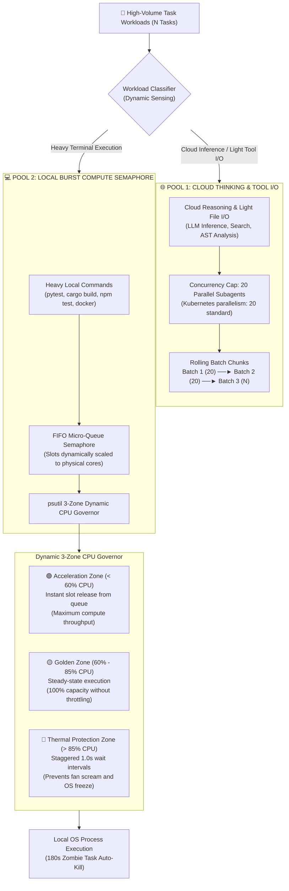
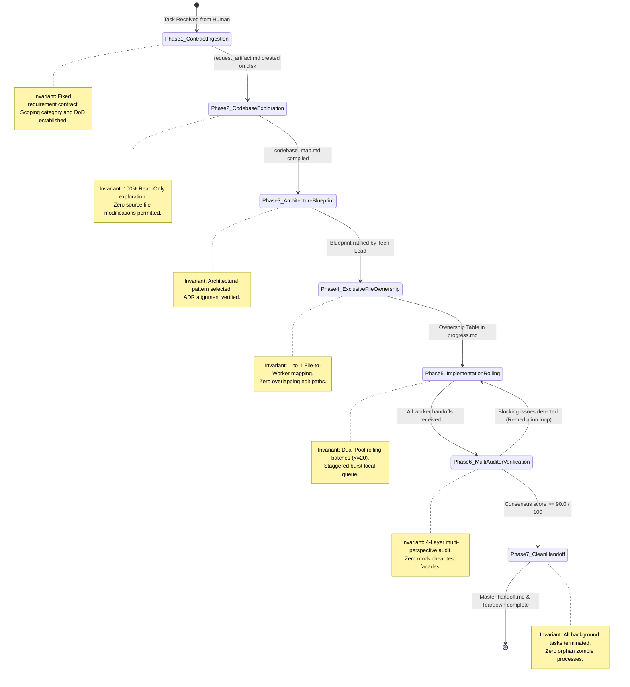
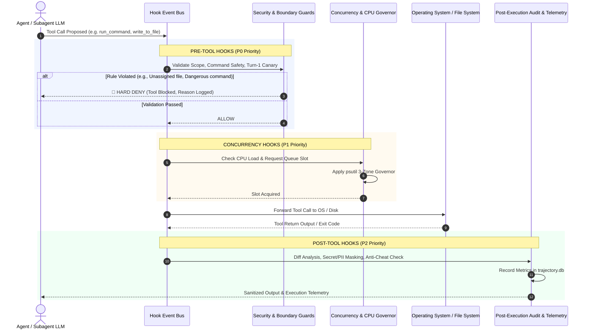
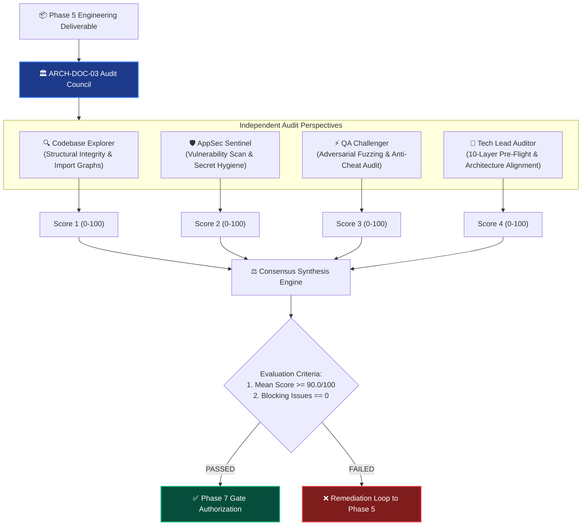

# 🏛️ Enterprise Agent Governance Framework — Architecture Specification (ARCHITECTURE.md)

> **In-Depth Technical Architecture, Asymmetric Dual-Pool Concurrency, Physical Runtime Interception & Multi-Auditor Governance.**

[](#)
[](#)
[](#)

---

## 📑 Architectural Table of Contents

1. [Architectural Axioms & Design Principles](#1-architectural-axioms--design-principles)
2. [Sơ Đồ 1: 3-Tier Multi-Agent Hierarchy Architecture](#2-sơ-đồ-1-3-tier-multi-agent-hierarchy-architecture)
3. [Sơ Đồ 2: Asymmetric Dual-Pool Concurrency & Dynamic CPU Governor](#3-sơ-đồ-2-asymmetric-dual-pool-concurrency--dynamic-cpu-governor)
4. [Sơ Đồ 3: The 7-Phase Sequential Workflow & State Machine](#4-sơ-đồ-3-the-7-phase-sequential-workflow--state-machine)
5. [Sơ Đồ 4: Physical Hook Interception Engine Lifecycle](#5-sơ-đồ-4-physical-hook-interception-engine-lifecycle)
6. [Sơ Đồ 5: ARCH-DOC-03 Multi-Auditor Panel Protocol](#6-sơ-đồ-5-arch-doc-03-multi-auditor-panel-protocol)
7. [Dynamic Hardware Auto-Sensing Engine](#7-dynamic-hardware-auto-sensing-engine)
8. [Blast Radius Isolation & Exclusive File Ownership](#8-blast-radius-isolation--exclusive-file-ownership)
9. [Context Window Hygiene & Laconic Pointer Dispatch](#9-context-window-hygiene--laconic-pointer-dispatch)

---

## 1. Architectural Axioms & Design Principles

The **Enterprise Agent Governance Framework (EAGF)** is built upon four foundational axioms designed to eliminate the inherent unreliability, race conditions, and uncontrolled resource consumption of autonomous AI agent networks:

1. **Zero-Trust Physical Enforcement:** Software safety cannot rely on prompt instructions, system rules text, or LLM self-restraint. All tool invocations (`run_command`, `write_to_file`, `replace_file_content`, `invoke_subagent`) must pass through an out-of-process, deterministic runtime hook interceptor that executes at the operating system layer.
2. **Strict No-Code Boundary for Orchestrators:** Orchestrator agents (Tier 1 Executive Agent and Tier 2 Project Managers) must never touch source code. They ingest stakeholder intent, establish scope contracts, allocate files, and schedule specialized workers.
3. **Decoupled Compute Environments (Asymmetric Dual-Pool):** High-concurrency cloud reasoning (LLM API calls) and heavy local compute (compiling, testing, container builds) have fundamentally different resource profiles. Cloud thinking can scale up to 20 parallel workers, while local burst compute must be throttled dynamically to the physical hardware profile.
4. **Decentralized Multi-Auditor Panel (ARCH-DOC-03):** Single-auditor verification is inherently vulnerable to bias and false positives. High-assurance deliverables require a consensus panel consisting of independent Explorer, Reviewer, Challenger, and Auditor agents achieving $\ge 90.0/100$ consensus with zero blocking issues.

---

## 2. Sơ Đồ 1: 3-Tier Multi-Agent Hierarchy Architecture

The organizational structure separates governance, coordination, and technical execution into 3 immutable tiers backed by a foundation of physical runtime hooks:



---

## 3. Sơ Đồ 2: Asymmetric Dual-Pool Concurrency & Dynamic CPU Governor

Traditional AI workflows either bottleneck on sequential execution or spawn unlimited subagents that overwhelm host CPU resources. EAGF divides execution into two isolated pools:



---

## 4. Sơ Đồ 3: The 7-Phase Sequential Workflow & State Machine

EAGF organizes project lifecycle into a strict finite-state machine. A phase cannot be marked complete until all phase gate invariants are satisfied and verified on disk:



---

## 5. Sơ Đồ 4: Physical Hook Interception Engine Lifecycle

Physical hooks intercept agent tool calls in real time. If any invariant is violated, the hook returns non-zero exit codes to block execution:



---

## 6. Sơ Đồ 5: ARCH-DOC-03 Multi-Auditor Panel Protocol

Single-agent verification produces confirmation bias. Phase 6 enforces the **ARCH-DOC-03 Decentralized Multi-Auditor Panel**:



---

## 7. Dynamic Hardware Auto-Sensing Engine

Rather than relying on hardcoded concurrency limits, EAGF's `hardware_sensor.py` dynamically queries the host environment using operating system APIs and the `psutil` library:

```python
# Conceptual Auto-Sensing Logic
def determine_execution_capacity():
    physical_cores = psutil.cpu_count(logical=False) or 2
    total_ram_gb = psutil.virtual_memory().total / (1024 ** 3)
    
    # Scale local compute slots proportionally
    if physical_cores <= 4:
        local_burst_slots = max(2, physical_cores - 1)
    elif physical_cores <= 16:
        local_burst_slots = int(physical_cores * 0.75)
    else:
        local_burst_slots = min(48, int(physical_cores * 0.5))
        
    return {
        "cloud_concurrency_cap": 20,
        "local_burst_slots": local_burst_slots,
        "ram_reserve_gb": max(2.0, total_ram_gb * 0.15)
    }
```

### Elastic Hardware Profile Support:
- **Low-Power Laptops (2 Cores / 4-8 GB RAM):** Automatically scales local burst slots to 2, increases thermal pause intervals to 2.0s, and maintains fluid host responsiveness.
- **Developer Workstations (4-8 Cores / 16-32 GB RAM):** Allocates 3–6 local burst slots, maintaining peak CPU utilization between 60% and 85%.
- **Enterprise Build Servers (16-128 Cores / 64-512 GB RAM):** Scales up to 24–48 simultaneous local processes with massive compilation throughput.

---

## 8. Blast Radius Isolation & Exclusive File Ownership

EAGF enforces **Zero Overlapping File Ownership**:
1. In Phase 4, the PM Orchestrator partitions all project files among active workers.
2. The assignment is published in `progress.md` before any worker is spawned.
3. The hook `scope_boundary_enforcer.py` intercepts every `write_to_file` and `replace_file_content` call. If an agent attempts to write to a path outside its registered scope, the operation is blocked with `ERR_OUT_OF_SCOPE_MODIFICATION`.
4. This completely eliminates file write collisions, merge conflicts, and unintentional state regressions.

---

## 9. Context Window Hygiene & Laconic Pointer Dispatch

Context window saturation causes catastrophic degradation in LLM reasoning capabilities. EAGF enforces two strict hygiene invariants:

### 1. Laconic Pointer Dispatch
PMs do not inject code files or lengthy specifications into the `invoke_subagent` prompt. Instead:
- PM writes `DISPATCH.md` (Contract) and `BRIEFING.md` (Context) directly to `.agents/[worker_id]/`.
- The prompt sent to the subagent is a compact pointer ($\le 20$ lines) instructing the subagent to load its instructions from disk.

### 2. Successor Chaining (Handoff Invariant)
When a PM Orchestrator approaches context saturation ($\ge 40$ tool calls):
- The PM compiles a complete, self-contained state checkpoint: `handoff.md`.
- The PM spawns a successor PM, passing only a pointer to `handoff.md`.
- The predecessor PM terminates gracefully, resetting context to 0% bloat while preserving 100% of project momentum.
