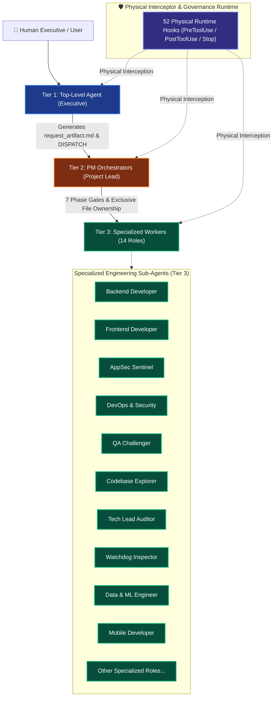
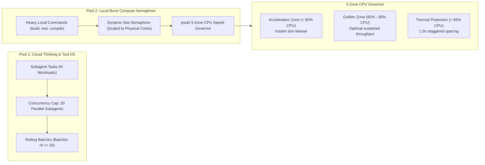

# 🛡️ Enterprise Agent Governance Framework (EAGF)

> **Autonomous Multi-Agent Orchestration, Physical Runtime Safety & Dynamic Hardware Governor for Production AI Systems.**

[](LICENSE)
[](#-3-tier-hierarchical-architecture)
[](#-dual-pool-concurrency--dynamic-hardware-governor)
[](#-52-physical-runtime-hooks)
[](#-dynamic-hardware-auto-sensing)
[](README_VN.md)

---

## 🌟 Executive Overview

As Large Language Model (LLM) agents evolve from simple chatbots into autonomous software engineering fleets capable of executing shell commands, modifying codebases, and delegating subagents, **unguarded agent execution poses catastrophic enterprise risks**:
- **Hallucination Cascades:** Autonomous agents believing in erroneous code they generated and compounding errors across hundreds of file edits.
- **Anti-Cheat Violations & Facades:** Agents writing hollow tests (`assert True`), mocking production databases, or hardcoding outputs to bypass verification gates.
- **Runaway Resource Starvation:** Spawning dozens of unthrottled subagents that saturate host CPUs, freeze user interfaces, and exhaust operating system file descriptors.
- **Context Fragmentation:** Bloating LLM context windows with sprawling chat histories, leading to goal drift and severe reasoning degradation.

The **Enterprise Agent Governance Framework (EAGF)** solves these failure modes through **Physical Runtime Interception**, a **3-Tier Hierarchical Governance Model**, an **Asymmetric Dual-Pool Concurrency Governor**, and a deterministic **7 Phase Gates Pipeline**.

Instead of relying on prompt compliance or LLM "goodwill", EAGF enforces safety and architectural integrity at the operating system and tool execution boundary with nanosecond-level physical hooks.

---

## 🏛️ 3-Tier Hierarchical Architecture

EAGF organizes agent fleets into an immutable hierarchy with strict separation of concerns and an enforced **No-Code Policy for Orchestrators**:



### 1. Tier 1: Top-Level Executive Agent
- **Role:** Direct interface with the human stakeholder.
- **Immutable Invariant:** **ABSOLUTELY FORBIDDEN FROM WRITING OR MODIFYING CODE.**
- **Responsibilities:** Captures user intent, scopes high-level requirements, compiles `request_artifact.md`, and delegates execution entirely to Tier 2 Lead PMs.

### 2. Tier 2: PM Orchestrators (Lead Project Managers)
- **Role:** Technical governance, task decomposition, and milestone coordination.
- **Immutable Invariant:** **STRICTLY FORBIDDEN FROM TOUCHING APPLICATION SOURCE CODE.**
- **Responsibilities:** Manages the 7 Phase Gates, assigns Exclusive File Ownership, schedules staggered rolling worker batches, and synthesizes multi-dimensional audit reports.

### 3. Tier 3: Specialized Technical Workers (14 Dedicated Roles)
- **Role:** Atomic implementation, adversarial verification, security hardening, and telemetry inspection.
- **Key Roles:** `backend_developer`, `frontend_developer`, `appsec_sentinel`, `devops_security`, `qa_challenger`, `codebase_explorer`, `tech_lead_auditor`, `lead_watchdog`, `state_checkpoint_curator`, `data_ml_engineer`, `mobile_app_developer`, `pm_challenger`, `watchdog_inspector`, `codebase_explorer`.
- **Operating Rule:** Each worker operates exclusively on designated files within its assigned blast radius and produces a standardized 5-component handoff report upon completion.

---

## ⚡ Dual-Pool Concurrency & Dynamic Hardware Governor

To achieve maximum throughput without CPU throttling or machine freeze, EAGF decouples cloud inference from local compute execution using an **Asymmetric Dual-Pool Architecture**:



### Dynamic Hardware Auto-Sensing
Unlike rigid frameworks with hardcoded core limits, EAGF features **dynamic hardware auto-sensing**:
- **Automatic Host Detection:** Dynamically samples physical CPU cores, logical threads, and total available RAM across Windows, Linux, and macOS via `psutil` and `os.cpu_count()`.
- **Elastic Compute Sizing:**
  - *2 to 4 physical cores:* Allocates 2–3 concurrent local burst execution slots.
  - *8 to 16 physical cores:* Scales to 6–12 concurrent burst execution slots.
  - *32 to 128 server cores:* Scales linearly up to 24–48 concurrent burst execution slots while reserving safety headroom for OS stability.
- **Bypass for Lightweight Operations:** Non-compute terminal commands (`git status`, `ls`, `dir`, `echo`) bypass the semaphore queue instantly.
- **Zombie Task Auto-Reclamation:** Background processes running longer than 180 seconds without heartbeat telemetry are automatically terminated and logged.

---

## 🚦 The 7 Phase Gates Workflow

Every technical feature or system modification progresses through a sequential 7-gate lifecycle. Progression is strictly monotonic; skipping gates triggers physical runtime denial (`GATE_ORDER_VIOLATION`):

| Phase Gate | Name | Mandatory Deliverables | Enforced Invariants |
|---|---|---|---|
| **Phase 1** | Contract Ingestion & Scoping | `request_artifact.md` | Fixed input contract; eliminates ambiguous goal drift. |
| **Phase 2** | Codebase Exploration | `codebase_map.md` | Read-only exploration; zero write permissions permitted. |
| **Phase 3** | Architecture Blueprint | `architecture_blueprint.md` | Tech Lead sign-off; ADR compliance and design validation. |
| **Phase 4** | Exclusive File Ownership | `progress.md` (Ownership Table) | 1-to-1 File-to-Worker mapping; prevents concurrent write collisions. |
| **Phase 5** | Implementation & Rolling Execution | Source code, Unit tests | Max 20 subagents/batch; staggered burst queue for test suites. |
| **Phase 6** | Multi-Auditor Panel Verification | `AUDIT_REPORT.md` (ARCH-DOC-03) | 4-layer independent review; score $\ge 90.0/100$, 0 blocking issues. |
| **Phase 7** | Clean Handoff & Resource Cleanup | `handoff.md`, Terminal teardown | 5-section handoff report; 100% background process termination. |

---

## 🛡️ 52 Physical Runtime Hooks

EAGF deploys 52 specialized physical interceptors at critical agent lifecycle events (`PreInvocation`, `PreToolUse`, `PostToolUse`, and `Stop`). If an agent attempts an unauthorized action, the hook aborts execution at the operating system level:

```
[Agent Action Proposed]
         │
         ▼
┌────────────────────────────────────────┐
│ PreToolUse Hook Bus                    │
│ ├─ scope_boundary_enforcer.py          │ ──► Denies edits outside Exclusive Ownership
│ ├─ dangerous_command_guard.py          │ ──► Denies rm -rf, drop table, format, forkbombs
│ ├─ turn1_enforced_gate_guard.py        │ ──► Denies tool execution before reading rules
│ ├─ burst_execution_guard.py            │ ──► Throttles heavy commands via CPU semaphore
│ └─ anti_sequential_guard.py            │ ──► Denies monolithic single-worker assignments
└────────────────────────────────────────┘
         │ (If Passed)
         ▼
[Tool Executed on Operating System]
         │
         ▼
┌────────────────────────────────────────┐
│ PostToolUse Hook Bus                   │
│ ├─ diff_security_inspector.py          │ ──► AST inspection for injected malicious syntax
│ ├─ secret_and_pii_scanner.py           │ ──► Masks keys, tokens, and personal credentials
│ ├─ anti_cheat_test_auditor.py          │ ──► Flags empty assertions and test mocks
│ └─ goal_drift_telemetry_tracker.py     │ ──► Measures progress against request contract
└────────────────────────────────────────┘
```

---

## 📊 Comparison Matrix

| Capability | Standard LLM / Vanilla Agent | Typical Multi-Agent Frameworks | Enterprise Agent Governance Framework (EAGF) |
|---|---|---|---|
| **Code Execution Boundary** | Unrestricted / Permissive | Basic prompt guardrails | **52 Physical OS-level Hooks (`HARD DENY`)** |
| **Orchestrator Role Discipline** | Often edits code directly | Role prompts without enforcement | **Strict No-Code Policy enforced at runtime** |
| **Concurrency Architecture** | Sequential single-thread | Unbounded parallel execution | **Asymmetric Dual-Pool (Cap 20 Cloud / Semaphore Local)** |
| **Hardware Adaptability** | None (causes system lockup) | Hardcoded thread limits | **Dynamic CPU & Memory Auto-Sensing (`psutil` 3-Zone)** |
| **File Collision Prevention** | File overwrites common | Lockfile conflicts | **Exclusive File Ownership Table (Pre-allocated)** |
| **Verification & Testing** | Self-checking (prone to bias) | Single pass test run | **ARCH-DOC-03 Decentralized Multi-Auditor Panel** |
| **Context Window Hygiene** | Context bloat & goal drift | Naive rolling truncation | **Pointer Dispatch + Structured 5-Part Handoffs** |
| **Turn 1 Compliance** | Not verified | Best-effort prompt ingestion | **Canary Token Proof-of-Reading Gate** |

---

## 🚀 Quick Start (5 Minutes)

### 1. Requirements
- Python 3.10+
- Dependencies: `psutil`, `pydantic`
```bash
pip install psutil pydantic
```

### 2. Integration into Runtime
Copy or symlink `enterprise_agent_governance/` into your agent runtime directory or workspace:
```bash
# Point runtime to hooks configuration
export AGENT_GOVERNANCE_HOOKS="./enterprise_agent_governance/hooks/hooks.json"
```

### 3. Verify System Health
Run the built-in self-test suite to validate hardware auto-sensing and hook integrity:
```bash
python enterprise_agent_governance/hook_utils/hardware_sensor.py
```

For complete integration instructions across Google Antigravity, Claude Code, Cursor, and custom CLI environments, see [QUICKSTART.md](QUICKSTART.md).

---

## 📚 Documentation Index

- 📘 **[ARCHITECTURE.md](ARCHITECTURE.md)** — In-depth architectural specification with 5 comprehensive Mermaid diagrams.
- 📂 **[DIRECTORY_GUIDE.md](DIRECTORY_GUIDE.md)** — Complete file-by-file blueprint and directory guide.
- ⚡ **[QUICKSTART.md](QUICKSTART.md)** — Step-by-step 5-minute setup and configuration manual.
- 🤖 **[README_AI.md](README_AI.md)** — System Prompt and Turn 1 Onboarding Guide tailored for AI Agents and LLMs.
- 🇻🇳 **[README_VN.md](README_VN.md)** — Bản tài liệu kiến trúc và hướng dẫn vận hành toàn diện bằng Tiếng Việt.
- 📜 **[LICENSE](LICENSE)** — Official MIT License (2026).

---

## 📄 License & Open Source Governance

Distributed under the **MIT License**. See [LICENSE](LICENSE) for complete terms.

Copyright (c) 2026 Enterprise Agent Governance Framework Contributors. Open for enterprise adoption, academic research, and community contributions.
