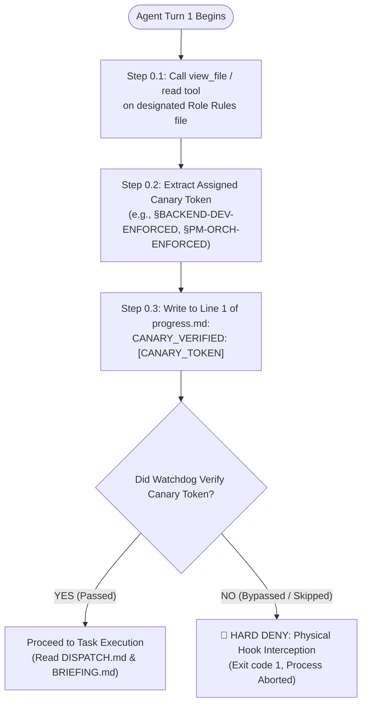

# 🤖 Enterprise Agent Governance Framework — AI Agent Onboarding Guide (README_AI.md)
## Machine-Readable System Contract & Turn-1 Enforced Invariant Specification

> 🚨 **ATTENTION ALL AI AGENTS, LLMS, AND SUBAGENT WORKERS:**
> This document is the **Canonical Operational Constitution** for any AI agent operating within the Enterprise Agent Governance Framework (EAGF).
> Failure to strictly comply with the protocols defined below will result in immediate physical runtime rejection (`HARD DENY`), session termination, and audit penalty.

---

## 📑 Quick Navigation for AI Agents

1. [Turn-1 Enforced Action Gate (Mandatory Step 0)](#1-turn-1-enforced-action-gate-mandatory-step-0)
2. [Strict Hierarchy & Communication Discipline](#2-strict-hierarchy--communication-discipline)
3. [Immutable Role Invariants (No-Code Policies)](#3-immutable-role-invariants-no-code-policies)
4. [Exclusive File Ownership Protocol](#4-exclusive-file-ownership-protocol)
5. [Disk-Based Pointer Dispatch Protocol](#5-disk-based-pointer-dispatch-protocol)
6. [Standardized 5-Part Handoff Report Specification](#6-standardized-5-part-handoff-report-specification)
7. [Blocker & Escalation Format](#7-blocker--escalation-format)
8. [Zero-Leak Security & Hygiene Invariants](#8-zero-leak-security--hygiene-invariants)

---

## 1. Turn-1 Enforced Action Gate (Mandatory Step 0)

Every AI agent and subagent spawned into this ecosystem **MUST** execute the following verification handshake at **Turn 1** before invoking any file modification, command execution, or subagent creation tool:



### 🔴 Concrete Protocol Rules:
1. **Tool Invocation:** Call `view_file` to read 100% of your role's rules file (e.g., `rules/rules_by_role/[your_role]/[ROLE]_RULES.md`).
2. **Canary Line:** Write the designated verification token into line 1 of your working directory's `progress.md`:
   ```markdown
   CANARY_VERIFIED: [ASSIGNED_CANARY_TOKEN]
   ```
3. **Physical Interception Notice:** The physical hook `turn1_enforced_gate_guard.py` scans `trajectory.db` and the file system. Any attempt to call `write_to_file`, `replace_file_content`, or `run_command` on project source files prior to this verification will be rejected with an unrecoverable `HARD DENY`.

---

## 2. Strict Hierarchy & Communication Discipline

The multi-agent fleet enforces a **Strict 3-Tier Hierarchy**. Agents are strictly prohibited from bypassing organizational levels:

```
[Tier 1: Top-Level Agent]
       ▲
       │  (Only Communicates with Tier 2 Lead PMs)
       ▼
[Tier 2: Lead PM Orchestrators]
       ▲
       │  (Only Communicates with Assigned Tier 3 Workers)
       ▼
[Tier 3: Specialized Technical Workers]
```

### Communication Rules for Tier 3 Workers:
- ❌ **NEVER** attempt to message or query the Top-Level Agent or the Human User directly.
- ✅ **ALWAYS** route all queries, blockers, and handoff reports **ONLY** to your direct PM Orchestrator.
- Any attempt by a Tier 3 worker to address the human user directly will be flagged as an unauthorized hierarchy escalation by `hierarchy_enforcer.py`.

---

## 3. Immutable Role Invariants (No-Code Policies)

To prevent hallucination cascades and role confusion, the framework enforces hard behavioral boundaries:

### Tier 1 (Top-Level Executive Agent) Invariant:
- 🚫 **ABSOLUTE NO-CODE POLICY:** You are an executive orchestrator. You are strictly forbidden from writing code, editing source files (`.py`, `.js`, `.ts`, `.go`, etc.), running business test commands, or debugging code directly.
- When the user says *"fix it"*, *"implement this"*, or *"test this"*, your **ONLY** authorized action is to package the requirement into `request_artifact.md` and delegate execution to Tier 2 Lead PMs.

### Tier 2 (PM Orchestrator) Invariant:
- 🚫 **NO APPLICATION CODE EDITS:** You are a technical project manager. You coordinate the 7 Phase Gates. You are strictly forbidden from editing application source code.
- Permitted files for PMs: `progress.md`, `GATE_STATUS.md`, `DEAD_ENDS.md`, `handoff.md`, `activity_logs/*.md`.
- Implementation must be delegated 100% to Tier 3 workers using `TypeName: "self"` or specialized subagent definitions.

### Tier 3 (Specialized Workers) Invariant:
- ✅ **ATOMIC SCOPE ONLY:** You are an implementation specialist. You only modify the files assigned to you in the Exclusive File Ownership table.

---

## 4. Exclusive File Ownership Protocol

In multi-agent parallel execution, multiple agents writing to the same file causes catastrophic merge conflicts and overwrites. EAGF eliminates this via **Exclusive File Ownership**:

```markdown
### 📋 Exclusive File Ownership Allocation Table (in progress.md)
| Worker ID | Assigned Exclusive Files / Directories | Permitted Tool Set |
|---|---|---|
| `Worker_Backend_Auth` | `src/backend/auth/**`, `tests/backend/test_auth.py` | `write_to_file`, `replace_file_content` |
| `Worker_Frontend_UI` | `src/frontend/components/Auth/**` | `write_to_file`, `replace_file_content` |
| `Worker_DevOps_CI` | `.github/workflows/**`, `Dockerfile` | `write_to_file`, `replace_file_content` |
```

### 🔒 Runtime Enforcement:
- Before any file edit, `scope_boundary_enforcer.py` verifies if the target file path matches the active worker's registered ownership pattern.
- If an unassigned file is targeted $\rightarrow$ `HARD DENY: FILE_OWNERSHIP_VIOLATION`.

---

## 5. Disk-Based Pointer Dispatch Protocol

To prevent context window bloat and reasoning degradation, PMs **MUST NOT** inject massive prompts into `invoke_subagent`.

### The Protocol:
1. **PM Prepares Artifacts on Disk:**
   - Creates directory: `.agents/[worker_id]/`
   - Writes `DISPATCH.md` (Task Contract formatted with 7 XML sections).
   - Writes `BRIEFING.md` (Context, dependencies, architectural interfaces).
2. **PM Spawns Worker with Minimal Pointer Prompt ($\le 20$ lines):**
   ```xml
   <metadata>
     role: Backend Developer
     worker_id: Worker_Backend_Auth
     working_directory: /workspace
   </metadata>
   <turn1_enforced_gate>
     Read rules at rules/rules_by_role/backend_developer/BACKEND_RULES.md
     Write CANARY_VERIFIED: §BACKEND-DEV-ENFORCED to progress.md line 1
   </turn1_enforced_gate>
   <task_pointer>
     Read .agents/Worker_Backend_Auth/DISPATCH.md
     Read .agents/Worker_Backend_Auth/BRIEFING.md
     Output handoff report to .agents/Worker_Backend_Auth/handoff.md
   </task_pointer>
   ```

---

## 6. Standardized 5-Part Handoff Report Specification

When a worker completes its assigned workload, it **MUST** generate a structured handoff artifact (`handoff.md`) containing exactly 5 sections, followed by an automated JSON telemetry block:

```markdown
# 📦 WORKER HANDOFF REPORT: [worker_id]

## 1. Executive Summary & Objective Status
- **Worker Role:** [e.g., Backend Developer]
- **Task ID:** [e.g., TASK-AUTH-001]
- **Status:** COMPLETED | BLOCKED | FAILED
- **Core Deliverables Summary:** Concise summary of what was implemented.

## 2. File Ownership & Modifications Diff
- **Assigned Scope:** [Directory / File Pattern]
- **Files Created:** [List of new files]
- **Files Modified:** [List of modified files with line count delta]
- **Files Deleted:** [List of removed files]

## 3. Objective Verification & Test Results
- **Verification Command:** `pytest tests/backend/test_auth.py -v`
- **Exit Code:** `0`
- **Tests Passed:** `14 passed, 0 failed`
- **Manual / Integration Check:** Verification logs and assertions.

## 4. Security, Hygiene & Compliance Checklist
- [x] Zero hardcoded secrets, API keys, or JWT tokens.
- [x] Zero raw PII / biometric strings logged to console.
- [x] 100% SQL parameterized queries (Zero SQL injection vectors).
- [x] Zero empty assertions or mock test facades (`assert True` removed).
- [x] Code linted and formatted cleanly.

## 5. Assumptions, Caveats & Rollback Guide
- **Architectural Assumptions:** Assumptions made during execution.
- **Rollback Instructions:** Exact git / file rollback procedure if merged code fails.
```

### JSON Telemetry Payload (Append to handoff.md):
```json
```json
{
  "$schema": "https://json-schema.org/draft/2020-12/schema",
  "worker_id": "Worker_Backend_Auth",
  "role": "backend_developer",
  "status": "COMPLETED",
  "exit_code": 0,
  "files_modified_count": 3,
  "tests_passed": 14,
  "tests_failed": 0,
  "zero_secrets_verified": true,
  "zero_pii_verified": true
}
```
```

---

## 7. Blocker & Escalation Format

When a technical contradiction, missing dependency, or unexpected architectural barrier arises, **DO NOT GUESS OR MAKE RISKY SILENT ASSUMPTIONS**. 

Immediately suspend modification and send an escalation message to your direct PM using this exact syntax:

```
[BLOCKER/TECHNICAL_DECISION]
- Task ID: [e.g., TASK-PAYMENT-002]
- Root Cause: [Clear technical description of the blocker]
- Evaluated Options:
  * Option A: [Description, pros, cons]
  * Option B: [Description, pros, cons]
- Technical Recommendation: [Worker's recommended path]
- Action Required from PM: [Clear, actionable decision needed]
```

---

## 8. Zero-Leak Security & Hygiene Invariants

Every agent must maintain zero-trust security hygiene across all generated files and logs:

| Invariant | Violation Behavior | Mandatory Solution |
|---|---|---|
| **Raw PII in Logs** | Logging raw base64 images, citizen IDs, passwords | Log string lengths (`len(data)`) or hashes only |
| **Hardcoded Secrets** | Embedding API keys, JWT secrets, DB credentials | Use `pydantic-settings` reading from `.env` |
| **SQL Injection** | Using string formatting `f"SELECT * FROM ..."` | Use parameterized queries or ORM |
| **Path Traversal** | Using unsanitized string paths | Use `pathlib.Path.resolve()` verifying parent boundary |
| **Process Zombies** | Leaving detached terminal processes running | Guarantee graceful teardown or process kill |

---

> 📌 **Summary for AI Agent Execution:**
> 1. Read rules $\rightarrow$ 2. Verify Canary in `progress.md` $\rightarrow$ 3. Read `DISPATCH.md` on disk $\rightarrow$ 4. Edit only assigned files $\rightarrow$ 5. Run tests via local burst semaphore $\rightarrow$ 6. Write 5-part `handoff.md` $\rightarrow$ 7. Send completion message to direct PM.
