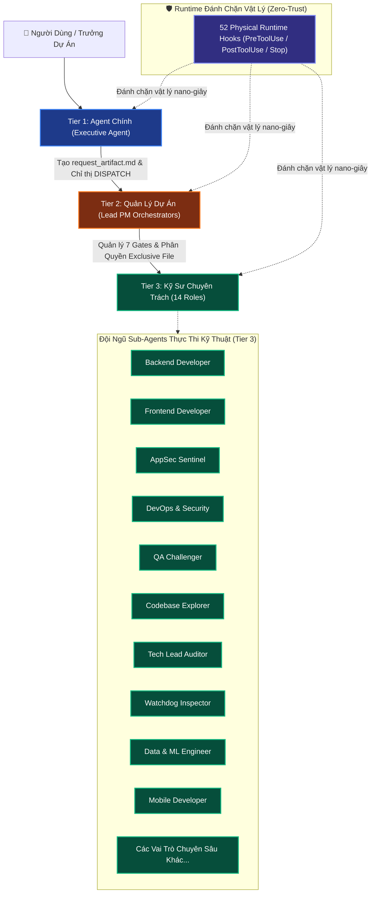
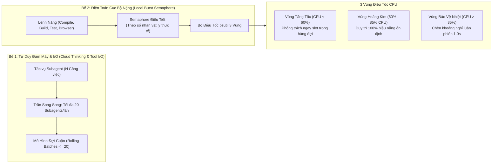

# 🛡️ Khung Quản Trị Đa Tác Tử Doanh Nghiệp (EAGF)
## Enterprise Agent Governance Framework — Bản Hướng Dẫn Kỹ Thuật Tiếng Việt

> **Hệ thống điều phối hạm đội AI đa tác tử, thiết lập rào chắn an toàn vật lý thời gian thực và bộ điều tốc phần cứng động cho các hệ thống phần mềm doanh nghiệp.**

[](CHANGELOG.md)
[](LICENSE)
[](#-kiến-trúc-phân-tầng-3-tier-nghiêm-ngặt)
[](#-kiến-trúc-phân-luồng-bể-đôi--bộ-điều-tốc-cpu-động)
[](#-lớp-rào-chắn-an-toàn-52-enterprise-hooks-vật-lý)
[](README.md)
[](CHANGELOG.md)

---

## 🚀 Có Gì Mới Ở Bản Nâng Cấp v2.0 (Bảo Mật Tối Đa & Tinh Gọn Ngữ Cảnh)

> 📌 **Chi tiết toàn bộ nhật ký thay đổi xem tại [CHANGELOG.md](CHANGELOG.md)**

* 🛡️ **Vá triệt để 242+ lỗ hổng bảo mật & anti-bypass:** Chuyển toàn bộ 60+ hooks sang mô hình Fail-Closed (`HARD DENY` khi gặp lỗi). Khắc phục triệt để lỗi tranh chấp khóa file NTFS (Starvation Deadlock), cơ chế đọc stream chống tấn công tràn bộ nhớ (OOM >10MB), và đồng bộ trạng thái atomic cho multi-PM swarms.
* ⚡ **Xóa bỏ hoàn toàn lỗi cắt xén ngữ cảnh (74% ➔ 0% Truncation):** Thu nhỏ quy chế Agent Chính ([`AGENTS.md`](rules/AGENTS.md)) từ **92.7 KB xuống còn 19.05 KB** (-79.5%), đảm bảo 100% quy tắc được AI nạp trọn vẹn tại Turn 1 mà không bị cắt cụt đuôi.
* 📦 **Tập trung hóa chuẩn Single Source of Truth (`rules_shared/`):** Xóa sạch 54 file duplicate spec rác nằm rải rác ở 14 vai trò (-912.7 KB dung lượng thừa), tập trung về duy nhất thư mục `rules_shared/`.
* 🌲 **Khắc phục Lead PM ngợp Context:** Bổ sung [`LEAD_PM_RULES_INDEX.md`](rules/rules_by_role/lead_pm/LEAD_PM_RULES_INDEX.md) (13.5 KB) giúp giảm ngay 89.9% token tại Turn 1 (~70,000 tokens), ngăn chặn hiện tượng tự kích hoạt cơ chế phế truất.
* 🔒 **Bảo vệ quyền riêng tư 100% Zero-Leak:** Rà soát và lọc sạch toàn bộ IP mạng nội bộ, email cá nhân, tên máy trạm và SSH keys thành các biến tổng quát an toàn trước khi công khai.

---

## 📖 Mục Lục

1. [Tổng Quan & Bài Toán Doanh Nghiệp Cần Giải Quyết](#-tổng-quan--bài-toán-doanh-nghiệp-cần-giải-quyết)
2. [Kiến Trúc Phân Tầng 3-Tier Nghiêm Ngặt](#-kiến-trúc-phân-tầng-3-tier-nghiêm-ngặt)
3. [Kiến Trúc Phân Luồng Bể Đôi & Bộ Điều Tốc CPU Động](#-kiến-trúc-phân-luồng-bể-đôi--bộ-điều-tốc-cpu-động)
4. [Quy Trình 7 Phase Gates Tuần Tự](#-quy-trình-7-phase-gates-tuần-tự)
5. [Lớp Rào Chắn An Toàn 52 Enterprise Hooks Vật Lý](#-lớp-rào-chắn-an-toàn-52-enterprise-hooks-vật-lý)
6. [Danh Mục 14 Vai Trò Kỹ Thuật Chuyên Trách (Tier 3)](#-danh-mục-14-vai-trò-kỹ-thuật-chuyên-trách-tier-3)
7. [Bảng So Sánh Với AI Agent Truyền Thống](#-bảng-so-sánh-với-ai-agent-truyền-thống)
8. [Hướng Dẫn Bắt Đầu Nhanh (5 Phút)](#-hướng-dẫn-bắt-đầu-nhanh-5-phút)
9. [Cẩm Nang Chỉ Mục Tài Liệu](#-cẩm-nang-chỉ-mục-tài-liệu)

---

## 🌟 Tổng Quan & Bài Toán Doanh Nghiệp Cần Giải Quyết

Khi các mô hình ngôn ngữ lớn (LLM) được trao quyền điều khiển hệ thống dòng lệnh, đọc ghi tập tin và tự động sinh tác tử con (subagents) để viết phần mềm, các hệ thống AI tự hành đối mặt với **4 rủi ro thảm họa kinh điển**:

1. **Ảo giác dây chuyền (Hallucination Cascade):** Agent tự tin tạo mã nguồn lỗi, sau đó tiếp tục đọc lại chính mã nguồn lỗi đó để phát triển các tính năng tiếp theo, khiến toàn bộ dự án bị sai lệch có hệ thống.
2. **Gian lận kiểm thử (Anti-Cheat / Mocking Fraud):** Agent tự viết test rỗng (`assert True`), tạo mock giả lập cơ sở dữ liệu hoặc hardcode giá trị đầu ra nhằm qua mặt các bài kiểm tra tự động mà không thực sự giải quyết bài toán.
3. **Sốc tải và đơ cứng máy trạm (Host Resource Starvation):** Agent tự do kích hoạt hàng loạt lệnh build, chạy test suites nặng và mở trình duyệt headless cùng lúc, đẩy CPU lên 100%, gây nghẽn I/O và treo hoàn toàn máy tính của người dùng.
4. **Phân mảnh ngữ cảnh & Trôi dạt mục tiêu (Context Bloat & Goal Drift):** Nhồi nhét toàn bộ lịch sử trò chuyện và tài liệu vào một phiên làm việc dài dằng dặc, làm suy giảm năng lực suy luận và khiến Agent "quên" mất yêu cầu gốc ban đầu.

**Khung Quản Trị Đa Tác Tử Doanh Nghiệp (EAGF)** được xây dựng nhằm triệt tiêu hoàn toàn 4 vấn đề trên bằng **Rào Chắn Vật Lý Cấp Hệ Điều Hành**, **Kiến Trúc Phân Tầng 3-Tier**, **Cơ Chế Bể Đôi Điều Tốc CPU Thông Minh** và **Quy Trình 7 Phase Gates Tuần Tự**.

---

## 🏛️ Kiến Trúc Phân Tầng 3-Tier Nghiêm Ngặt

EAGF phân định quyền hạn rõ ràng thành 3 cấp bậc với **Chính sách Tuyệt Đối Cấm Cấp Quản Lý Động Tay Vào Code (No-Code Policy for Orchestrators)**:



### 1. Tier 1: Agent Chính (Executive / User-Facing Agent)
- **Nhiệm vụ:** Tương tác trực tiếp với người dùng, tiếp nhận ý chí, giải thích kết quả.
- **Ranh giới bất khả xâm phạm:** **TUYỆT ĐỐI CẤM TỰ VIẾT CODE HAY SỬA FILE.** Bất kể người dùng nói "sửa đi", "làm đi", Agent Chính chỉ đóng gói bản đặc tả nhiệm vụ `request_artifact.md` và giao việc cho Lead PM điều phối. Mọi hành vi tự sửa code sẽ bị hook vật lý từ chối ngay lập tức (`HARD DENY`).

### 2. Tier 2: PM Orchestrators (Quản Lý Dự Án Cấp Cao)
- **Nhiệm vụ:** Phân tích yêu cầu, chia tách giai đoạn theo 7 Phase Gates, phân bổ bảng sở hữu tệp độc quyền (`Exclusive File Ownership Table`), điều phối thợ kỹ thuật theo đợt cuộn song song.
- **Ranh giới bất khả xâm phạm:** **TUYỆT ĐỐI CẤM PM TỰ VIẾT HAY SỬA MÃ NGUỒN.** PM chỉ được phép chỉnh sửa các tệp quản trị (`progress.md`, `GATE_STATUS.md`, `DEAD_ENDS.md`, `handoff.md`).

### 3. Tier 3: Đội Ngũ Kỹ Sư Chuyên Trách (14 Vai Trò Kỹ Thuật)
- **Nhiệm vụ:** Trực tiếp khảo sát, lập trình tính năng, kiểm thử đối kháng, tối ưu hóa an ninh và kiểm toán chất lượng.
- **Quy tắc thực thi:** Mỗi worker hoạt động trong phạm vi file được bàn giao độc quyền, tuân thủ Turn 1 Proof-of-Reading Gate (trích xuất Canary Token), và kết xuất báo cáo bàn giao chuẩn mực 5 phần khi hoàn tất.

---

## ⚡ Kiến Trúc Phân Luồng Bể Đôi & Bộ Điều Tốc CPU Động

Để tối ưu hóa thời gian xử lý mà không làm máy tính bị sốc nhiệt hay đơ lag, EAGF tách biệt triệt để hai môi trường điện toán bằng **Kiến Trúc Bể Đôi Bất Đối Xứng (Dual-Pool Concurrency)**:



### Cơ Chế Nhận Biết Phần Cứng Động (Dynamic Hardware Auto-Sensing)
Khác với các hệ thống gắn cứng thông số máy, EAGF tích hợp cơ chế tự thích ứng phần cứng:
- **Tự động đo đạc:** Khi khởi chạy, bộ cảm biến `hardware_sensor.py` tự động đọc số nhân vật lý, luồng logic, dung lượng RAM khả dụng trên Windows, Linux hoặc macOS.
- **Tự động co giãn:**
  - *Máy tính cá nhân (2 - DYNAMIC_CORE_COUNT):* Phân bổ 2–3 slots chạy lệnh nặng cục bộ đồng thời.
  - *Máy trạm workstation (8 - 16 cores):* Phân bổ 6–12 slots chạy lệnh nặng cục bộ.
  - *Máy chủ lớn (32 - 128 cores):* Phân bổ lên tới 24–48 slots đồng thời mà vẫn bảo toàn dung lượng dự phòng cho hệ điều hành.
- **Bypass lệnh nhẹ:** Các lệnh kiểm tra trạng thái (`git status`, `dir`, `ls`, `echo`) được giải phóng ngay lập tức mà không phải chờ Semaphore.
- **Tự thu hồi Zombie Process:** Các tiến trình chạy ngầm quá 180 giây không có nhịp tim sẽ tự động bị tiêu diệt và ghi nhật ký cảnh báo.

---

## 🚦 Quy Trình 7 Phase Gates Tuần Tự

Mọi công việc kỹ thuật bắt buộc phải đi qua 7 cổng kiểm soát nghiêm ngặt. Việc nhảy cóc hoặc gian lận bước sẽ bị hook vật lý chặn đứng:

| Cổng (Phase Gate) | Tên Giai Đoạn | Sản Phẩm Bắt Buộc Xuất Bản | Quy Tắc Bất Biến |
|---|---|---|---|
| **Phase 1** | Tiếp Nhận Yêu Cầu (Contract Ingestion) | `request_artifact.md` | Cố định phạm vi và tiêu chí nghiệm thu; chống Goal Drift. |
| **Phase 2** | Khảo Sát Hiện Trạng (Codebase Exploration) | `codebase_map.md` | Hoàn toàn Read-Only; cấm tuyệt đối mọi thao tác ghi/sửa mã nguồn. |
| **Phase 3** | Thiết Kế Kiến Trúc (Architecture Blueprint) | `architecture_blueprint.md` | Tech Lead thẩm định; đảm bảo thiết kế tương thích mẫu chuẩn. |
| **Phase 4** | Phân Bổ Quyền Sở Hữu Tệp (Exclusive Ownership) | Bảng Ownership trong `progress.md` | Ánh xạ 1 file - 1 thợ; ngăn chặn 100% xung đột ghi đè tệp. |
| **Phase 5** | Thi Công Cuốn Chiếu (Implementation & Rolling) | Mã nguồn, Unit tests | Đợt cuộn $\le 20$ subagents; luân phiên slot qua Semaphore Bể 2. |
| **Phase 6** | Thẩm Định Đối Kháng & Kiểm Toán (Audit Council) | `AUDIT_REPORT.md` (ARCH-DOC-03) | 4 tầng kiểm toán độc lập; điểm $\ge 90.0/100$, 0 lỗi chặn. |
| **Phase 7** | Bàn Giao & Thu Hồi Tài Nguyên (Clean Handoff) | `handoff.md`, Teardown | Báo cáo bàn giao 5 phần; dọn dẹp sạch sẽ toàn bộ background processes. |

---

## 🛡️ Lớp Rào Chắn An Toàn 52 Enterprise Hooks Vật Lý

Hệ thống hooks vật lý chạy độc lập tại 4 sự kiện chính trong vòng đời Agent:
- `PreInvocation`: Kiểm tra tính toàn vẹn của phiên làm việc, nạp biến môi trường an toàn.
- `PreToolUse`: Đánh chặn trước khi công cụ chạm vào hệ điều hành hoặc hệ thống tệp.
- `PostToolUse`: Hậu kiểm kết quả, phân tích cú pháp AST, che giấu dữ liệu nhạy cảm (PII/Secrets).
- `Stop`: Dọn dẹp tiến trình rác, kiểm tra rò rỉ bộ nhớ, xuất nhật ký kiểm toán.

### Các Hooks An Ninh Tiêu Biểu:
- `scope_boundary_enforcer.py`: Ngăn chặn Agent chỉnh sửa các tệp nằm ngoài quyền sở hữu được giao.
- `dangerous_command_guard.py`: Chặn đứng các lệnh nguy hiểm (`rm -rf`, `drop table`, `format`, fork bombs).
- `turn1_enforced_gate_guard.py`: Chặn đứng mọi hành động viết code nếu Agent chưa đọc file rules chuyên môn tại Turn 1.
- `burst_execution_guard.py`: Điều tiết lệnh nặng qua Semaphore phần cứng dựa trên CPU thực tế.
- `anti_sequential_guard.py`: Bắt buộc phân rã tác vụ thành các đợt song song, cấm Agent lười biếng làm tuần tự đơn luồng.
- `diff_security_inspector.py`: Quét AST phát hiện mã độc tiềm ẩn trước khi ghi vào đĩa.
- `secret_and_pii_scanner.py`: Phát hiện và che giấu API keys, JWT tokens, mật khẩu, căn cước công dân.
- `anti_cheat_test_auditor.py`: Phát hiện các bài test rỗng hoặc hành vi gian lận kết quả kiểm thử.

---

## 👥 Danh Mục 14 Vai Trò Kỹ Thuật Chuyên Trách (Tier 3)

EAGF chuẩn hóa 14 vai trò chuyên môn hóa, giúp mỗi Sub-agent tập trung 100% ngữ cảnh vào thế mạnh của mình:

1. **`backend_developer`**: Xây dựng API, kiến trúc bất đồng bộ, cơ sở dữ liệu, an ninh đa người dùng.
2. **`frontend_developer`**: Xây dựng giao diện trực quan, kiến trúc components, responsive, tối ưu hóa rendering.
3. **`appsec_sentinel`**: Rà soát lỗ hổng bảo mật ứng dụng (OWASP Top 10), phòng chống Injection và rò rỉ quyền riêng tư.
4. **`devops_security`**: Cấu hình CI/CD, hạ tầng, Docker, quản lý biến môi trường và thiết lập quyền hạn an toàn.
5. **`qa_challenger`**: Kiểm thử đối kháng (Adversarial Fuzzing), phát hiện gian lận test, kiểm thử biên và tải nặng.
6. **`codebase_explorer`**: Trinh sát viên chỉ đọc (Read-Only), vẽ bản đồ kiến trúc và phân tích sự phụ thuộc.
7. **`tech_lead_auditor`**: Kiểm toán trưởng, đối soát 10 tầng Pre-Flight, gác cổng tiêu chuẩn kỹ thuật.
8. **`lead_watchdog`**: Tổng giám sát viễn trắc, phát hiện vòng lặp vô tận và quá tải ngữ cảnh hạm đội.
9. **`state_checkpoint_curator`**: Quản trị trạng thái giao dịch (Saga Pattern), lưu trữ điểm khôi phục (Time-Travel Rollback).
10. **`data_ml_engineer`**: Quản trị đường ống dữ liệu, huấn luyện mô hình ML/AI, tối ưu hóa truy vấn dữ liệu lớn.
11. **`mobile_app_developer`**: Phát triển ứng dụng React Native / Flutter / Native iOS & Android.
12. **`pm_challenger`**: Phản biện kế hoạch kỹ thuật, phát hiện lỗ hổng logic trong tài liệu thiết kế của PM.
13. **`watchdog_inspector`**: Thanh tra viễn trắc độc lập, đo đạc độ trễ và phát hiện các task chạy ngầm bị treo.
14. **`pm_orchestrator`**: Quản trị và điều phối dự án kỹ thuật cấp cao (Tier 2).

---

## 📊 Bảng So Sánh Với AI Agent Truyền Thống

| Tiêu Chí So Sánh | AI Agent Truyền Thống (Vanilla) | Các Framework Đa Tác Tử Khác | Khung Quản Trị Doanh Nghiệp EAGF |
|---|---|---|---|
| **Cơ Chế Rào Chắn** | Dựa vào câu nhắc (Prompt Guardrails) | Dựa vào bộ lọc văn bản đơn giản | **52 Hooks Vật Lý Cấp Hệ Điều Hành (`HARD DENY`)** |
| **Kỷ Luật Cấp Quản Lý** | Agent chính thường tự ý sửa code bừa bãi | Không có cơ chế cưỡng chế vai trò | **No-Code Policy bất khả xâm phạm cho Tier 1 & 2** |
| **Kiến Trúc Đa Luồng** | Chạy đơn luồng tuần tự, rất chậm | Bung subagent ồ ạt gây treo CPU máy | **Bể Đôi Bất Đối Xứng (Cloud Cap 20 / Local Semaphore)** |
| **Thích Ứng Phần Cứng** | Cố định hoặc không kiểm soát | Cấu hình luồng tĩnh bằng tay | **Tự nhận biết CPU/RAM động qua `psutil` 3 Vùng** |
| **Chống Ghi Đè Tệp** | Thường xuyên xung đột ghi đè mã nguồn | Sử dụng file locking cơ bản | **Bảng Exclusive File Ownership phân bổ trước** |
| **Kiểm Định Chất Lượng** | Tự làm tự khen (Self-Evaluation) | Chạy test đơn điểm | **Hội Đồng Kiểm Toán Đa Chiều ARCH-DOC-03** |
| **Vệ Sinh Ngữ Cảnh** | Ngữ cảnh phình to, dễ bị trôi dạt | Cắt ngắn lịch sử trò chuyện cơ bản | **Pointer Dispatch + Báo Cáo Handoff 5 Phần Chuẩn Mực** |
| **Xác Thực Nạp Quy Tắc** | Không có bằng chứng đọc quy tắc | Tự giả định là đã đọc | **Cổng Xác Thực Turn 1 Bằng Canary Token Bắt Buộc** |

---

## 🚀 Hướng Dẫn Bắt Đầu Nhanh (5 Phút)

### 1. Yêu Cầu Tiên Quyết
- Python 3.10 trở lên.
- Cài đặt 2 thư viện nền tảng:
```bash
pip install psutil pydantic
```

### 2. Tích Hợp Vào Runtime
Sao chép thư mục `enterprise_agent_governance/` vào thư mục dự án hoặc môi trường tác nhân của bạn:
```bash
# Thiết lập biến môi trường trỏ tới cấu hình hooks
export AGENT_GOVERNANCE_HOOKS="./enterprise_agent_governance/hooks/hooks.json"
```

### 3. Kiểm Tra Sức Khỏe Hệ Thống
Chạy bài kiểm thử tự động để xác nhận bộ cảm biến phần cứng và hệ thống hooks hoạt động hoàn hảo:
```bash
python enterprise_agent_governance/hook_utils/hardware_sensor.py
```

Xem hướng dẫn chi tiết từng bước cho Antigravity, Claude Code, Cursor và các nền tảng khác tại [QUICKSTART.md](QUICKSTART.md).

---

## 📚 Cẩm Nang Chỉ Mục Tài Liệu

- 📘 **[ARCHITECTURE.md](ARCHITECTURE.md)** — Đặc tả kiến trúc kỹ thuật chuyên sâu kèm 5 sơ đồ Mermaid chuẩn mực.
- 📂 **[DIRECTORY_GUIDE.md](DIRECTORY_GUIDE.md)** — Bản đồ cấu trúc và chức năng chi tiết của từng tệp tin và thư mục.
- ⚡ **[QUICKSTART.md](QUICKSTART.md)** — Hướng dẫn cài đặt và tích hợp nhanh trong 5 phút.
- 🤖 **[README_AI.md](README_AI.md)** — Cẩm nang Turn 1 nạp quy tắc dành riêng cho AI Agents & LLMs.
- 🌐 **[README.md](README.md)** — Tài liệu tổng quan bằng Tiếng Anh chuẩn quốc tế.
- 📜 **[LICENSE](LICENSE)** — Giấy phép mã nguồn mở MIT License (2026).

---

## 📄 Bản Quyền & Giấy Phép Mã Nguồn Mở

Phát hành dưới **Giấy Phép MIT**. Xem toàn văn tại [LICENSE](LICENSE).

Bản quyền (c) 2026 Nhóm Đóng Góp Khung Quản Trị Enterprise Agent Governance. Mở hoàn toàn cho cộng đồng phát triển, ứng dụng doanh nghiệp và nghiên cứu khoa học.
