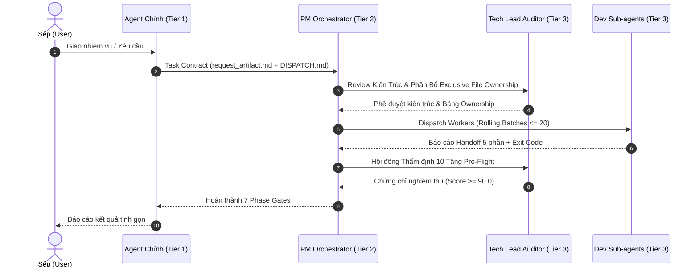

# 📋 TIÊU CHUẨN DOANH NGHIỆP VỀ SOP, TÀI LIỆU HÓA & MA TRẬN RACI
## (ENTERPRISE STANDARD OPERATING PROCEDURES & ROLE CONTRACT SPECIFICATION)

> 🔴 **MÃ TÀI LIỆU:** `RULE-GOV-P1-ENTERPRISE-SOP-01`<br>
> 🏷️ **CẤP ĐỘ ƯU TIÊN:** **P1 (Quan Trọng / Doanh Nghiệp Bắt Buộc)**<br>
> 🌐 **THAM CHIẾU QUỐC TẾ:** MetaGPT Standard Operating Procedures (SOPs), ChatDev Multi-Agent Waterfall Protocol, ISO/IEC/IEEE 29148 (Requirements Engineering), IEEE 1471 / ISO/IEC 42010 (Systems and Software Architecture), RACI Governance Model.<br>
> 🎯 **PHẠM VI ÁP DỤNG:** Tất cả các vai trò quản trị, điều phối và giám định hệ thống: PM Orchestrator, Tech Lead Auditor, PM Challenger, Lead Watchdog, State Checkpoint Curator.

---

## I. MỤC TIÊU & TRIẾT LÝ VẬN HÀNH (PHILOSOPHY & RATIONALE)

Trong hệ thống đa tác tử tự trị (Multi-Agent Systems), hơn 70% các lỗi nghiêm trọng không bắt nguồn từ cú pháp lập trình mà bắt nguồn từ **sự mơ hồ về yêu cầu (Requirement Ambiguity)** và **hiện tượng lệch mục tiêu tích lũy (Cumulative Goal Drift)** qua các tầng giao việc.

Triết lý cốt lõi của MetaGPT và ChatDev đã chứng minh:
> *"Code is easy, specification and consensus are hard. Standard Operating Procedures (SOPs) turn chaotic agent interactions into deterministic software engineering."*

Hệ thống thiết lập các quy chuẩn SOP bắt buộc nhằm:
1. **Loại bỏ hiện tượng "Nói một đằng làm một nẻo":** Mọi yêu cầu từ Sếp được chuẩn hóa thành PRD bất biến trước khi viết bất kỳ dòng mã nào.
2. **Xác lập ranh giới trách nhiệm đơn nhất (Single Responsibility Contract):** Mỗi vai trò tác tử có một bản hợp đồng đầu ra (Deliverable Contract) được định nghĩa bằng JSON Schema hoặc Markdown Schema nghiêm ngặt.
3. **Triệt tiêu xung đột phân quyền:** Bảng ma trận RACI cố định ngăn chặn hiện tượng chồng chéo hoặc đùn đẩy trách nhiệm giữa PM, Tech Lead và Workers.

---

## II. QUY CHUẨN PRODUCT REQUIREMENTS DOCUMENT (PRD SPECIFICATION)

Trước khi bắt đầu bất kỳ Phase Gate nào liên quan đến phát triển mã nguồn, PM Orchestrator bắt buộc phải lập hoặc nghiệm thu bản PRD chuẩn doanh nghiệp gồm **6 thành phần bất biến**:

```
┌─────────────────────────────────────────────────────────────────────────────────────────┐
│                           6 THÀNH PHẦN BẮT BIẾN CỦA PRD                                 │
├──────────────────────────────────┬──────────────────────────────────────────────────────┤
│ 1. Business Context & Objective  │ Bối cảnh bài toán, giá trị kinh doanh, mục tiêu cốt  │
│                                  │ lõi mà Sếp yêu cầu (Không dùng từ ngữ mơ hồ).        │
├──────────────────────────────────┼──────────────────────────────────────────────────────┤
│ 2. User Stories & Gherkin AC     │ Đặc tả hành vi người dùng theo chuẩn Gherkin:        │
│                                  │ Given [Tiền điều kiện] - When [Hành động] - Then     │
│                                  │ [Kết quả mong đợi].                                  │
├──────────────────────────────────┼──────────────────────────────────────────────────────┤
│ 3. System Boundary Scoping       │ Ranh giới hệ thống phân định rõ:                     │
│                                  │ • IN-SCOPE: Những gì BẮT BUỘC phải làm trong đợt này. │
│                                  │ • OUT-OF-SCOPE: Những gì TUYỆT ĐỐI CẤM làm thừa thãi.│
├──────────────────────────────────┼──────────────────────────────────────────────────────┤
│ 4. Non-Functional Requirements   │ Ràng buộc phi chức năng định lượng:                  │
│    (NFRs)                        │ Latency (ms), Concurrency (Bể 1 <= 20, Bể 2 <= 4),    │
│                                  │ Hardware Profile (DYNAMIC_CPU_CORE_COUNT, Windows 11),    │
│                                  │ Bảo mật PII VN (§30 PDPD: CCCD, MST, SĐT, BHYT).     │
├──────────────────────────────────┼──────────────────────────────────────────────────────┤
│ 5. User Journey & State Flow     │ Sơ đồ luồng trạng thái tuần tự chuẩn Mermaid.        │
├──────────────────────────────────┼──────────────────────────────────────────────────────┤
│ 6. Quantitative Definition of    │ Bộ tiêu chí nghiệm thu cụ thể: 100% tests pass,      │
│    Done (DoD)                    │ linter exit code 0, không có trailing whitespace,    │
│                                  │ kiểm toán PII VN: 0 chuỗi plaintext rò rỉ.          │
└──────────────────────────────────┴──────────────────────────────────────────────────────┘
```

### 1. Cấu Trúc Mẫu Tệp `PRD.md` Chuẩn Hóa
Mọi bản PRD phải tuân thủ đúng cấu trúc Markdown phân cấp:

```markdown
# Product Requirements Document (PRD): [Tên Tính Năng / Dự Án]

## 1. Mục Tiêu & Bối Cảnh Nghiệp Vụ
- **Mục tiêu cốt lõi:** [Mô tả trong 1-2 câu kết quả đo lường được]
- **Người hưởng lợi:** Sếp / Người dùng cuối / Hệ thống nội bộ.

## 2. Danh Sách User Stories & Tiêu Chí Chấp Nhận (Gherkin AC)
- **US-01:** [Tiêu đề User Story]
  ```gherkin
  Scenario: [Mô tả kịch bản kiểm thử]
    Given [Trạng thái tiền đề]
    When [Thao tác được thực thi]
    Then [Kết quả định lượng bắt buộc đạt được]
  ```

## 3. Ranh Giới Phạm Vi (Scope Boundaries)
- **IN-SCOPE:**
  - Tính năng A, B, C...
- **OUT-OF-SCOPE (Nghiêm cấm làm):**
  - Không refactor các module không liên quan.
  - Không thêm thư viện ngoài phạm vi đã duyệt.

## 4. Ràng Buộc Kỹ Thuật & Phi Chức Năng (NFR)
- Giới hạn tải: Máy trạm DYNAMIC_CPU_CORE_COUNT Windows 11.
- Hiệu năng CPU: Bể 2 không vượt quá 80% CPU qua Job Object.
- Thời gian phản hồi: p95 < 200ms.
- Bảo mật PII Việt Nam (§30): 100% trường dữ liệu CCCD, CMND, MST, SĐT VN, BHYT phải che giấu qua `mask_vietnam_pii()`, cấm log plaintext.

## 5. Tiêu Chuẩn Nghiệm Thu (Definition of Done)
- [ ] 100% Unit tests & Integration tests PASS.
- [ ] Ruff / ESLint exit code = 0 (0 warnings, 0 errors).
- [ ] 0 trailing whitespace, 0 EOF blank lines thừa.
- [ ] Kiểm toán PII VN (§30): 0 chuỗi plaintext CCCD/CMND/MST/SĐT/BHYT trong log và test artifacts.
```

---

## III. QUY CHUẨN THIẾT KẾ KIẾN TRÚC HỆ THỐNG (SYSTEM ARCHITECTURE DESIGN - SAD)

Mọi giải pháp kỹ thuật có độ phức tạp từ trung bình trở lên bắt buộc phải có tài liệu Kiến Trúc Hệ Thống (SAD) do Tech Lead Auditor chủ trì hoặc phê duyệt:

### 1. Nguyên Tắc Phân Rã Mô-Đun (Modular Decomposition)
- **Độ kết dính cao (High Cohesion):** Mỗi mô-đun chỉ giải quyết một miền nghiệp vụ duy nhất (Single Domain Logic).
- **Khớp nối lỏng (Loose Coupling):** Các mô-đun giao tiếp với nhau qua giao diện trừu tượng (Interfaces / Contracts / DTOs), không bao giờ phụ thuộc trực tiếp vào triển khai nội bộ.
- **Phân tách Data-Instruction:** Dữ liệu đầu vào từ người dùng hoặc bên ngoài không bao giờ được nối trực tiếp vào chuỗi lệnh thực thi hệ thống.

### 2. Chuẩn Hóa Sơ Đồ Kiến Trúc Bằng Mermaid
Mọi tài liệu kiến trúc phải bao gồm ít nhất 1 sơ đồ tuần tự (Sequence Diagram) hoặc luồng dữ liệu:



### 3. Quy Chuẩn Đặc Tả Hợp Đồng Giao Diện (Interface Contract Specification)
- Mọi API nội bộ hoặc giữa các tác tử phải được đặc tả bằng OpenAPI 3.1, Protobuf, hoặc Pydantic BaseSchema.
- Mọi trường dữ liệu bắt buộc phải có kiểu tường minh (`int`, `str`, `bool`, `datetime`), cấm dùng `Any` hoặc `dict` tự do không kiểm soát.

---

## IV. MA TRẬN PHÂN QUYỀN TRÁCH NHIỆM RACI (RACI MATRIX)

Hệ thống áp dụng chuẩn phân định trách nhiệm RACI chặt chẽ giữa các tầng tác tử:
- **R (Responsible):** Người trực tiếp làm và tạo ra sản phẩm.
- **A (Accountable):** Người chịu trách nhiệm cao nhất về kết quả cuối cùng (duy nhất 1 vai trò A cho mỗi hạng mục).
- **C (Consulted):** Người được tham vấn chuyên môn hai chiều trước khi ra quyết định.
- **I (Informed):** Người được thông báo một chiều về tiến độ và kết quả.

### Bảng Ma Trận RACI Toàn Hệ Thống:

| Giai Đoạn / Hạng Mục Công Việc | PM Orchestrator | Tech Lead Auditor | PM Challenger | Lead Watchdog | State Curator | Dev Workers |
|---|:---:|:---:|:---:|:---:|:---:|:---:|
| **Khảo sát yêu cầu & Lập PRD** | **A / R** | C | C | I | I | I |
| **Thiết kế Kiến trúc (SAD) & ADR**| C | **A / R** | C | I | I | C |
| **Phân bổ File Ownership** | **A** | R | I | C | I | I |
| **Lập trình tính năng (Code)** | A | C | I | I | I | **R** |
| **Giám sát viễn trắc & Loop Watch**| I | I | I | **A / R** | I | I |
| **Kiểm thử đối kháng & Fuzzing** | I | C | **A / R** | I | I | I |
| **Kiểm toán 10 Tầng Pre-Flight** | I | **A / R** | C | I | I | I |
| **Checkpoint Snapshot & Rollback**| C | C | I | I | **A / R** | I |
| **Nghiệm thu 7 Phase Gates** | **A / R** | C | C | C | C | I |

### Quy Tắc Xử Lý Xung Đột Phân Quyền (Conflict Escalation Path):
1. **Xung đột kỹ thuật giữa Dev Workers:** Tech Lead Auditor là người quyết định cuối cùng (A).
2. **Xung đột phạm vi (Scope Creep vs DoD):** PM Orchestrator là người quyết định cuối cùng (A) căn cứ theo `request_artifact.md`.
3. **Xung đột kiến trúc nghiêm trọng:** Tech Lead lập ADR đề xuất 2 phương án, PM Orchestrator phê duyệt phương án phù hợp với ràng buộc phần cứng của Sếp.

---

## V. GIAO THỨC BÀN GIAO TỰ CHỨA (SELF-CONTAINED HANDOFF PROTOCOL)

Khi hoàn thành bất kỳ task nào, mọi Subagent bắt buộc phải xuất báo cáo bàn giao `handoff.md` theo cấu trúc 5 thành phần tự chứa:

```
┌─────────────────────────────────────────────────────────────────────────────────────────┐
│                      5 THÀNH PHẦN BẮT BIẾN CỦA HANDOFF PACKAGE                          │
├──────────────────────────────────┬──────────────────────────────────────────────────────┤
│ 1. Artifact Path & Manifest      │ Liệt kê đường dẫn tuyệt đối của tất cả file tạo/sửa. │
├──────────────────────────────────┼──────────────────────────────────────────────────────┤
│ 2. Evidence Verification         │ Bằng chứng thực tế: Kết quả test, exit code, diff.   │
├──────────────────────────────────┼──────────────────────────────────────────────────────┤
│ 3. Dependency Delta              │ Khai báo package mới thêm (SHA256) hoặc biến môi     │
│                                  │ trường mới trong .env.example.                       │
├──────────────────────────────────┼──────────────────────────────────────────────────────┤
│ 4. Known Limitations & Edge Cases│ Trường hợp biên chưa phủ, giả định kỹ thuật đã dùng. │
├──────────────────────────────────┼──────────────────────────────────────────────────────┤
│ 5. Actionable Next Steps         │ Hướng dẫn cụ thể bước tiếp theo cho PM / Kế nhiệm.   │
└──────────────────────────────────┴──────────────────────────────────────────────────────┘
```

---

## VI. QUY TRÌNH QUẢN TRỊ THAY ĐỔI & ARCHITECTURE DECISION RECORDS (ADR)

Khi có bất kỳ thay đổi kiến trúc lớn nào (đổi framework, đổi cơ chế phân luồng, thay đổi cấu trúc database), bắt buộc phải lập tệp ADR lưu tại `docs/adr/ADR-YYYYMMDD-[Tên-Quyết-Định].md`:

```markdown
# ADR-001: Áp Dụng Windows Job Objects Cho Bộ Điều Tốc CPU

## 1. Trạng Thái: APPROVED
## 2. Bối Cảnh:
Lệnh subprocess nặng trên Windows 11 có thể để lại zombie processes khi timeout, gây chiếm dụng RAM và CPU của máy trạm Sếp.
## 3. Quyết Định Kỹ Thuật:
Sử dụng Win32 Job Objects API với cờ JOB_OBJECT_LIMIT_KILL_ON_JOB_CLOSE và giới hạn CPU Rate tối đa 80%.
## 4. Hệ Quả:
- Tích cực: 100% tiến trình con bị tiêu diệt sạch khi lệnh kết thúc; hệ thống không bao giờ bị đơ giật.
- Tiêu cực: Cần thêm wrapper Win32 API qua ctypes trên Windows.
## 5. Tiêu Chuẩn Tuân Thủ:
Hook burst_execution_guard.py chịu trách nhiệm cưỡng chế wrapper này.
```

---

## VII. QUY CHUẨN THẨM ĐỊNH HỘI ĐỒNG PRE-FLIGHT (ARCH-DOC-03 COMPLIANCE)

Trước khi bàn giao kết quả lên Agent Chính, Hội đồng Thẩm định do Tech Lead Auditor chủ trì phải chấm điểm theo thang điểm 100 dựa trên 5 trụ cột:

1. **Tuân thủ Kiến trúc (Architecture Conformance - 25đ):** Đúng ranh giới mô-đun, 0 vi phạm circular dependencies, 0 rò rỉ abstraction.
2. **Bảo mật & Chuỗi cung ứng (Security & Supply Chain - 25đ):** 100% dependencies có SHA256 hashes, 0 secrets plain-text, vượt qua Shannon Entropy scan, kiểm toán PII VN (§30: CCCD, CMND, MST, SĐT, BHYT) được che giấu 100%.
3. **Chất lượng Kiểm thử (Test Integrity - 20đ):** Đạt chuẩn Reproduction-First của SWE-bench, 100% test assertions có ý nghĩa (cấm `assert True`).
4. **Vệ sinh Kho mã nguồn (Repository Hygiene - 15đ):** 0 trailing whitespace, 0 EOF blank lines thừa, `.gitignore` được cưỡng chế tuyệt đối.
5. **Định lượng Tài nguyên (Resource Efficiency - 15đ):** Tuân thủ Bể 1 (Rolling Batches <= 20) và Bể 2 (Semaphore <= 4 slots), CPU peak < 85%.

> 🏆 **TIÊU CHUẨN THÔNG QUA (PASS GATE):** Điểm tổng kết phải đạt **$\ge 90.0 / 100.0$** và **0 lỗi chặn (Zero Blocking Issues)**. Mọi vi phạm dưới 90.0 điểm bắt buộc phải hoàn trả mã nguồn về Dev Worker sửa chữa ngay lập tức.

---
*Tài liệu quy chuẩn được ban hành theo Kiến Trúc Doanh Nghiệp Cấp Cao. 100% các thành viên và Subagents bắt buộc tuân thủ không ngoại lệ.*
